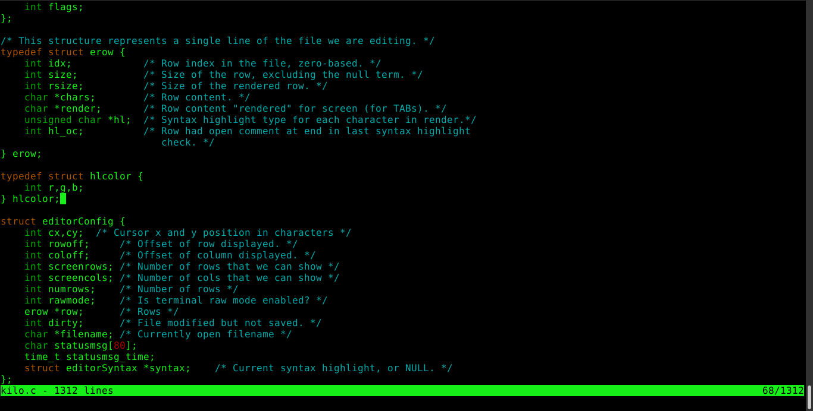

Kilo
===

Kilo is a small text editor.

Usage: `kilo <filename>`

Keys:

    CTRL-S: Save
    CTRL-Q: Quit
    CTRL-H: HELP
    CTRL-F: Find string in file (ESC to exit search, arrows to navigate)

 

Kilo does not depend on any library (not even curses). It uses fairly standard
VT100 (and similar terminals) escape sequences.
