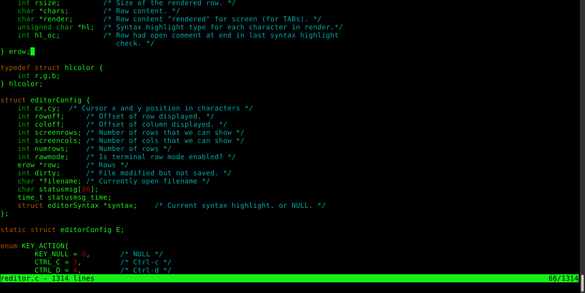

Reditor
===

Reditor is a small text editor.

Usage: `reditor <filename>`

Keys:

    CTRL-S: Save
    CTRL-Q: Quit
    CTRL-H: HELP
    CTRL-F: Find string in file (ESC to exit search, arrows to navigate)

 

Does not depend on any library (not even curses). It uses fairly standard
VT100 (and similar terminals) escape sequences.
